<!--
Regenerate the art:
  python scripts/fetch_contributions.py && python scripts/render_heatmap_svg.py
  python scripts/make_info_card.py
  python scripts/make_ascii_svg.py --invert --crop 350,260,912,820 --cols 88
The heatmap refreshes daily via .github/workflows/update-profile-art.yml.
-->

<h3><code>thiago@github ~ $ ./contributions.sh</code></h3>

  

<h3><code>thiago@github ~ $ whoami?</code></h3>
<table>
  <tr>
    <td valign="top"></td>
    <td valign="top"></td>
  </tr>
</table>

<code>all art generated in-repo · heatmap refreshed daily by GitHub Actions · no external services</code>

